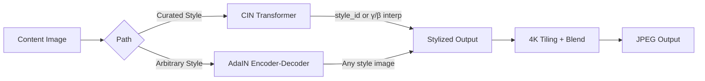

# StyleForge

**Neural Style Transfer Engine** — Curated multi-style CIN model + arbitrary AdaIN path, served via FastAPI + React.

[](https://github.com/Asura369/StyleForge/actions/workflows/ci.yml)
[](https://colab.research.google.com/github/Asura369/StyleForge/blob/main/StyleForge.ipynb)

---

## What is StyleForge?

StyleForge is an AI-powered tool that transforms your photos into works of art. Upload any image and instantly apply the visual style of famous paintings — from Van Gogh's swirling Starry Night to Hokusai's dramatic Great Wave.

**What makes it special:**
- **Instant results** — Unlike other tools that take minutes per image, StyleForge processes photos in seconds
- **Five curated styles** — Choose from masterpieces by Van Gogh, Hokusai, Vermeer, Kandinsky, and Monet
- **Style blending** — Mix two artistic styles together to create unique combinations
- **Works on any computer** — Runs efficiently on standard hardware, no expensive GPU required
- **High resolution support** — Process images up to 4K quality without losing detail

**Perfect for:**
- Artists and designers exploring creative possibilities
- Photographers adding artistic flair to their work
- Educators demonstrating AI and art concepts
- Anyone curious about neural style transfer

---

## Architecture



**Dual inference path:**
- **CIN** (Dumoulin 2017): Single model handles 5 curated styles via conditional instance normalization. Supports γ/β interpolation for continuous style blending.
- **AdaIN** (Huang & Belongie 2017): Arbitrary style transfer — upload any style image. Frozen VGG encoder + trained decoder.

---

## Features

| Feature | Detail |
|---------|--------|
| Multi-style CIN | 5 curated public-domain styles in one model (~6MB) |
| Style interpolation | Continuous γ/β blending between any two CIN styles |
| Arbitrary style | AdaIN path for user-uploaded style images |
| 4K tiling | Overlapping tiles (512px, 64px overlap) with linear-blend stitching |
| AMP training | fp16 autocast + GradScaler on T4 (~1.5x speedup) |
| Async jobs | Large images (>1280px) processed via background queue |
| ONNX export | Optional onnxruntime path for CPU inference |

---

## Curated Styles

| ID | Style | Artist | Year |
|----|-------|--------|------|
| 0 | Starry Night | Vincent van Gogh | 1889 |
| 1 | The Great Wave | Katsushika Hokusai | 1831 |
| 2 | Girl with a Pearl Earring | Johannes Vermeer | 1665 |
| 3 | Composition VIII | Wassily Kandinsky | 1923 |
| 4 | Water Lilies | Claude Monet | 1906 |

All images are public domain. Source: WikiArt / respective museum collections.

### Style Images

The 5 curated style images are bundled in the `styles/` directory. All images are public domain from Wikimedia Commons:

- [Starry Night](https://commons.wikimedia.org/wiki/File:Van_Gogh_-_Starry_Night_-_Google_Art_Project.jpg) (Van Gogh, 1889)
- [The Great Wave](https://commons.wikimedia.org/wiki/File:The_Great_Wave_off_Kanagawa.jpg) (Hokusai, 1831)
- [Girl with a Pearl Earring](https://commons.wikimedia.org/wiki/File:1665_Girl_with_a_Pearl_Earring.jpg) (Vermeer, 1665)
- [Composition VIII](https://commons.wikimedia.org/wiki/File:Wassily_Kandinsky_Composition_VIII.jpg) (Kandinsky, 1923)
- [Water Lilies](https://commons.wikimedia.org/wiki/File:Claude_Monet_-_Water_Lilies_-_1933.1157_-_Art_Institute_of_Chicago.jpg) (Monet, 1906)

---

## Quick Start

### Prerequisites

- **Python 3.12+** (tested on 3.12)
- **Node.js 18+** (for frontend development)
- **Git** (for cloning)
- **Docker** (optional, for containerized deployment)

### Installation

#### 1. Clone the Repository

```bash
git clone https://github.com/Asura369/StyleForge.git
cd StyleForge
```

#### 2. Create Virtual Environment

```bash
python3 -m venv venv
source venv/bin/activate  # On Windows: venv\Scripts\activate
```

#### 3. Install Dependencies

**For production (FastAPI server):**
```bash
pip install -e ".[server]"
```

**For development (Streamlit + testing):**
```bash
pip install -e .
pip install -r requirements-dev.txt
```

**For both:**
```bash
pip install -e ".[server,dev]"
```

#### 4. Download or Train the CIN Model

The server requires `models/multistyle.pth`. You have two options:

**Option A: Use pre-trained model (if available)**
```bash
# Download from releases or shared link
wget https://example.com/multistyle.pth -O models/multistyle.pth
```

**Option B: Train your own (see Training section below)**

#### 5. Verify Installation

```bash
# Check that the package imports correctly
python -c "import styleforge; print('OK')"

# Run the test suite
pytest tests/ -v

# Check linting
ruff check src/ tests/ app.py scripts/ server/
```

All 22 tests should pass.

---

### Running the Application

#### Production Mode (FastAPI + React)

**Step 1: Build the frontend**
```bash
cd frontend
npm install
npm run build
cd ..
```

**Step 2: Start the server**
```bash
uvicorn server.main:app --host 0.0.0.0 --port 8000
```

**Step 3: Open your browser**
```
http://localhost:8000
```

The server automatically serves the React frontend from `frontend/dist/`.

**Verify it's working:**
```bash
curl http://localhost:8000/api/health
# Should return: {"status":"ok","model_loaded":true,"styles_available":5}
```

#### Local Development Mode

**Backend (with hot reload):**
```bash
uvicorn server.main:app --reload --port 8000
```

**Frontend (separate terminal, with hot reload):**
```bash
cd frontend
npm run dev
```

The frontend dev server proxies `/api` requests to `localhost:8000`.

#### Docker

**Build the image:**
```bash
docker build -t styleforge .
```

**Run the container:**
```bash
docker run -p 8000:8000 styleforge
```

**Verify:**
```bash
curl http://localhost:8000/api/health
```

---

### Training a Model

#### Using Google Colab (Recommended)

1. Create `project.zip` for Colab:
   ```bash
   python scripts/create_colab_zip.py
   ```
   This creates a ~2.5MB zip containing:
   - `pyproject.toml` — package metadata
   - `src/styleforge/` — Python package
   - `styles/` — 5 style images + catalog
   - `configs/` — training configuration
   - `StyleForge.ipynb` — the notebook

2. Open [`StyleForge.ipynb`](StyleForge.ipynb) in [Google Colab](https://colab.research.google.com/)
3. Upload `project.zip` and run all cells
4. Download `multistyle.pth` from the output
5. Place it in `models/`

#### Manual Training (Local GPU)

**Prerequisites:**
- CUDA-capable GPU (or CPU, but slow)
- COCO dataset (val2017): ~1GB
- VGG16 weights: auto-downloaded on first run

**Step 1: Prepare the dataset**
```bash
# Download COCO val2017
wget http://images.cocodataset.org/zips/val2017.zip
unzip val2017.zip -d training_content/

# Verify dataset integrity
python scripts/check_data.py training_content/
```

**Step 2: Train the CIN model**
```bash
python -m styleforge.train_cin cin \
    --dataset training_content \
    --style-images styles/starry_night.jpg,styles/great_wave.jpg,styles/girl_pearl.jpg,styles/composition_viii.jpg,styles/water_lilies.jpg \
    --save-model-dir models/ \
    --save-model-name multistyle.pth \
    --cuda 1 \
    --amp 1 \
    --epochs 4 \
    --batch-size 4 \
    --lr 1e-3
```

**Step 3: Verify the model**
```bash
pytest tests/test_models.py -v
```

**Expected output:**
- Training takes ~30-45 minutes on a T4 GPU
- Loss should decrease from ~1e10 to ~1e8
- Model size: ~6MB
- Checkpoint saved to `models/multistyle.pth`

---

### Troubleshooting

**"Model not found" error:**
- Ensure `models/multistyle.pth` exists
- Check `CIN_MODEL_PATH` environment variable

**Frontend not loading:**
- Build the frontend: `cd frontend && npm run build`
- Check that `frontend/dist/` exists

**Out of memory on large images:**
- The tiling module automatically handles images >1280px
- Reduce `--batch-size` during training

**Tests fail:**
- Ensure all dependencies are installed: `pip install -e ".[dev]"`
- Check that `models/multistyle.pth` exists (or tests will skip)

For more details, see [`REPO_STRUCTURE.md`](REPO_STRUCTURE.md).

---

## Project Structure

See [`REPO_STRUCTURE.md`](REPO_STRUCTURE.md) for a complete annotated directory tree, data flow diagrams, model lifecycle, and troubleshooting guide.

```
StyleForge/
├── src/styleforge/          # Core Python package
├── server/main.py          # FastAPI API + static serving
├── frontend/               # Vite + React + TypeScript
├── styles/catalog.yaml     # Style roster + attribution
├── configs/default.yaml    # Training hyperparameters
├── scripts/                # Benchmark + data validation
├── tests/                  # pytest suite (24 tests)
├── Dockerfile              # Multi-stage: node → python
└── pyproject.toml          # Package config
```

---

## API Endpoints

| Method | Path | Description |
|--------|------|-------------|
| GET | `/api/health` | Model status |
| GET | `/api/styles` | Curated style list |
| POST | `/api/stylize` | Multipart image + style params → JPEG |
| GET | `/api/jobs/{id}` | Poll async job status / get result |

### POST /api/stylize

Form fields: `image` (file), `style_id` (int), or `style_a` + `style_b` + `alpha` for interpolation, `quality` (standard/high_res).

---

## Development

```bash
pip install -e ".[dev]"
ruff check src/ tests/ app.py scripts/ server/
mypy src/styleforge/ --ignore-missing-imports
pytest tests/ -v
```

---

## Benchmarks

Run `python scripts/evaluate.py` to regenerate `docs/benchmarks.md` with latency tables for your hardware.

---

## License

MIT
